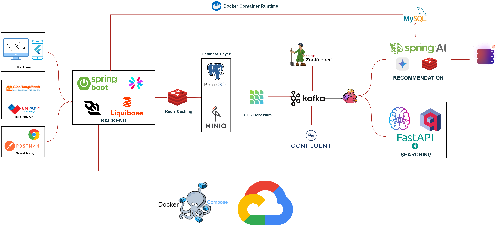

# CONNECTED - Social Media Application Integrated with E-Commerce Platform

## 📌 Overview

CONNECTED is a full-featured social media platform with integrated e-commerce capabilities. Users can interact socially while seamlessly engaging in commercial activities.

## 🏗️ System Architecture



## 🚀 Getting Started

### ✅ Prerequisites

Make sure you have the following installed:

- Node.js (>= 16.x)
- maven
- npm or yarn
- Java JDK (>= 17)
- PostgreSQL, Mysql, Qdrant
- Docker (optional, for containerized deployment)

### 🔧 Installation

1. **Clone the repository**

```bash
git clone https://github.com/ThanhDuy21110759/connected.git
cd connected
```

## 🐳 Docker Compose Setup

To streamline development and testing, we use Docker Compose to spin up supporting services such as Kafka, Debezium, Flink, MySQL, and others.

### 📦 Services Overview

| Service Name        | Description                               |
| ------------------- | ----------------------------------------- |
| `satchat`           | Chat/messaging service (NodeJS or Spring) |
| `changecapture-e2e` | Change Data Capture with Kafka & Debezium |
| `FlinkSocial`       | Real-time stream processing with Flink    |
| `Qdrant`            | docker run -d -p 6333:6333 qdrant/qdrant  |

### 🧰 Step-by-Step Setup

#### 1. Clone Supporting Repos (Optional)

Ensure you have the required repositories locally:

```bash
cd satchat
cd satchat-fe
cd changecapture-e2ed
cd FlinkSociald
cd sprinaid
cd semantic-search-qdrantd
```

#### 2. Build & Run Spring Boot Applications

For the Spring-based applications (`satchat`, `springai`), perform the following steps in each respective directory:

```bash
# Format the code
mvn spotless:apply

# Build the application (skip tests)
mvn clean install -DskipTests
or
JAVA_HOME=/usr/lib/jvm/jdk-21.0.7 mvn clean install -DskipTests (for jdk version 21)
```

#### 3. Run Java application (SpringAI & satchat)

```bash
nohup java -jar target/springai-0.0.1-SNAPSHOT.war > app.log 2>&1 &
nohup /usr/lib/jvm/jdk-21.0.7/bin/java -jar target/satchat-0.0.1-SNAPSHOT.jar > app.log 2>&1 &

# Monitor the logs
tail -f app.log
```

#### 4. Install & Run Python Semantic Search Service

Navigate to the `semantic-search-qdrant` directory and run the following commands:

```bash
# Update package lists and install pip
sudo apt update && sudo apt install python3-pip

# Install required Python packages
pip3 install -r requirements.txt

# Source bash profile (if needed)
source ~/.bashrc

# Start the FastAPI service (background with log)
nohup uvicorn search-service:app --host 0.0.0.0 --port 8000 > app.log 2>&1 &

# Monitor the logs
tail -f app.log
```

#### 5. Deploy Flink Job

After building the `FlinkSocial` project (using Maven or your preferred method), deploy the job as follows:

```bash
# Copy the built JAR to the Flink JobManager container
docker cp target/FlinkSocial-1.0-SNAPSHOT.jar jobmanager:/opt

# Run the job inside the container
docker exec -it jobmanager flink run -c org.example.StreamingJob /opt/FlinkSocial-1.0-SNAPSHOT.jar
```

## 🛑 Stopping Services & Cleaning Up

### Kill running Spring Boot processes

Kill `.war` apps (e.g., `springai`):

```bash
ps aux | grep '\.war'
ps aux | grep '\.war' | grep -v grep | awk '{print $2}' | xargs kill
```

Kill `jar` apps (e.g., `satchat`):

```bash
ps aux | grep '\.jar'
ps aux | grep '\.jar' | grep -v grep | awk '{print $2}' | xargs kill
```

Kill `uvicorn`

```bash
ps aux | grep uvicorn
pkill -f uvicorn
```

Stop all `container`

```bash
docker stop $(docker ps -q)
```
## 🌐 Mở cổng trên GCP bằng gcloud

```bash
# Mở cổng 8000
gcloud compute firewall-rules create allow-8000 \
  --allow tcp:8000 \
  --source-ranges 0.0.0.0/0 \
  --description "Allow port 8000"

# Mở cổng 8180
gcloud compute firewall-rules create allow-8180 \
  --allow tcp:8180 \
  --source-ranges 0.0.0.0/0 \
  --description "Allow port 8180"

# Mở cổng 8280
gcloud compute firewall-rules create allow-8280 \
  --allow tcp:8280 \
  --source-ranges 0.0.0.0/0 \
  --description "Allow port 8280"

# Mở cổng 6333
gcloud compute firewall-rules create allow-6333 \
  --allow tcp:6333 \
  --source-ranges 0.0.0.0/0 \
  --description "Allow port 6333"

# Mở cổng 9021
gcloud compute firewall-rules create allow-9021 \
  --allow tcp:9021 \
  --source-ranges 0.0.0.0/0 \
  --description "Allow port 9021"

# Check firewall rules
gcloud compute firewall-rules list
```
